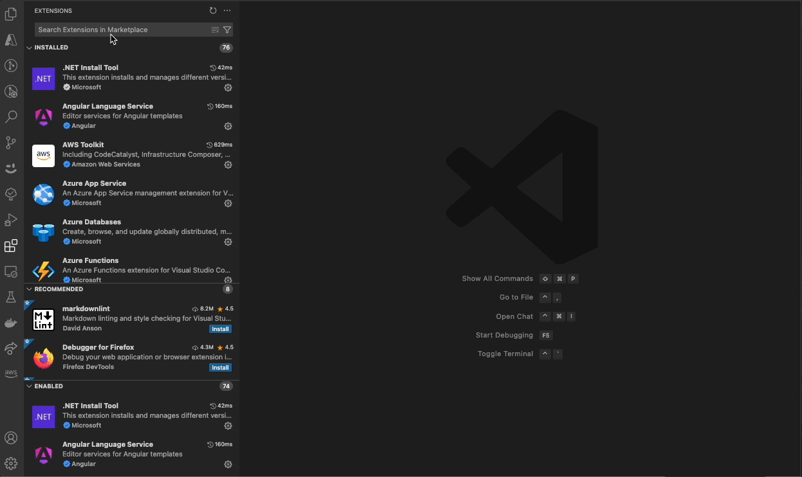

<div align="center">
  
  
  
  
</div>
<br />  
<div align="center">
  <picture>
    <source media="(prefers-color-scheme: dark)" srcset="assets/img/hai_build_logo_light.png">
    <source media="(prefers-color-scheme: light)" srcset="assets/img/hai_build_logo_theme.png">
    
  </picture>
</div>
<br />  

# 🚀 Code Generator

**HAI Code Generator** is a cutting-edge tool designed to simplify and automate task execution while enhancing code generation workflows. Leveraging Specif AI, it streamlines processes like task execution, file identification, and code documentation through intelligent automation and AI-driven capabilities.

> 🏗️ **Built on [Cline](https://github.com/cline/cline)**'s powerful foundation for AI-assisted development.

<div align="center" style="margin-top: 20px;">
  
</div>

## Table of Contents

- [🌟 Overview](#-overview)
- [📥 Getting Started](#-getting-started)
- [✨ Features](#-features)
- [🤝 Contributing](#-contributing)
- [📜 License](#-license)
- [🙏 Acknowledgments](#-acknowledgments)
- [📧 Contact](#-contact)

## 🌟 Overview

**HAI Code Generator** is designed to boost productivity and precision by automating task execution and integrating file management capabilities. It combines intelligent file indexing, context generation, and LLM-driven automation to minimize manual effort and ensure task accuracy. With user-friendly interfaces and configurable settings, HAI Code Generator is perfect for both developers and teams aiming to enhance their workflows.

## 📥 Getting Started
- Open Visual Studio Code → Extensions (⇧⌘X) → Search for “HAI Build” → Click Install
<div align="center" style="margin-top: 20px;">
  
</div>

- Upon installation, the HAI extension can be found in the sidebar.

<div align="center" style="margin-top: 20px;">
  
</div>

## ✨ Features

- [📝 HAI Tasks](#-hai-tasks)
- [🔍 File Identification](#-file-identification)
- [🎯 Custom Instructions](#-custom-instructions)
- [✏️ Inline Editing](#-inline-editing)
- [⚙️ Settings Interface](#-settings-interface)

### 📝 HAI Tasks
Harness the power of AI for seamless task management and user-story execution, HAI Code Generator integrates tasks generated by [Specif AI](https://github.com/presidio-oss/specif-ai), allowing them to be loaded directly into the HAI Tasks page. This streamlined process enables you to:

- **Review** AI-generated tasks within a dedicated interface.  
- **Execute** them instantly with a single click.  
- **Manage** all tasks in one place for improved clarity and productivity.  

By centralizing AI-driven tasks in HAI Code Generator, you can maintain an efficient workflow from ideation to execution.

<br>
  
  <div align="center">
    
    <p><i>Detailed View of HAI Tasks</i></p>
  </div>

- **In-Depth Story Review**  
  - View a story in detail by clicking the Eye icon, along with the corresponding list of tasks, providing comprehensive insights into objectives, prerequisites, and outcomes. 
  
- **In-Depth Task Review**  
  - Similar to user stories, tasks can be viewed in detail and executed directly from the same interface.
  
<br>

---

### 🔍 File Identification
Enhanced file identification with intelligent discovery and retrieval:

  <div align="center">
    
      <p><i>File Identification</i></p>
  </div>

#### Task-Based File Discovery
Transform the way you manage files by leveraging the core functionalities of **Task-Based File Discovery**, supported by advanced components like contextual code comments and indexing.


- **Contextual Code Comments**  
  - Automatically generate contextual comments for every identified file, offering deeper insights and clarifications.  
  - Store all generated comments in a dedicated folder, ensuring they are easily accessible without cluttering your codebase.

- **Faiss DB Indexing**  
  - Built on the robust vector-search engine, Faiss DB ensures real-time and highly accurate file indexing, enabling instant discovery of relevant files.  
  - Handles large repositories effortlessly, ensuring HAI Code Generator scales with your project's needs.

Together, these components form a cohesive system for efficient file identification, ensuring that Task-Based File Discovery is not just smart but also contextual.

---

### 🎯 Custom Instructions
HAI Code Generator's custom instruction sets help define code standards, preferred communication, and output formats to match your development workflow.
<div align="center">
   
     <p><i>Custom Instructions</i></p>
 </div>

#### Personalized AI-Driven Development
- Upload your own instruction sets to tailor HAI Code Generator to your unique requirements.
- Use these instructions to generate tasks, code, or customize the tool's behavior.
- Instruction sets are stored in the `.vscode/hai-instructions` folder, facilitating easy access and collaborative development.

These customizations empower developers to shape AI outputs that match their distinct coding style and preferences. 

---

### ✏️ Inline Editing
Enhance your code editing experience with inline editing, allowing you to make changes directly within the codebase.
 <div align="center">
   
     <p><i>Inline Editing</i></p>
 </div>

#### Seamless Quick Changes
- Click "Edit with hAI" and provide a brief prompt to effortlessly transform selected code.
- Perfect for quick edits or corrections without navigating away from your codebase.

---


### ⚙️ Settings Interface
Customize and seamlessly integrate advanced language and embedding models into your AI-powered workflow, ensuring you stay at the forefront of AI innovations.
- **LLM Configuration**   
  - Seamlessly integrate and switch between various language models, ensuring compatibility with the latest AI advancements. Supported models include OpenRouter, Anthropic, Google Gemini, GCP Vertex AI, AWS Bedrock, OpenAI, OpenAI-Compatible models, LM Studio, and Ollama.
  
- **Embedding Configuration**  
  - Effortlessly configure and switch between supported embedding models, ensuring flexibility and adaptability for different use cases. Compatible embedding models include OpenAI-Compatible, OpenAI, and AWS Bedrock.
<div align="center" style="margin-top: 20px;">
  
  <p><i>Settings Interface</i></p>
</div>

## 🌟 Cline Features

- [🤖 AI Assistant Capabilities](#-ai-assistant-capabilities)
- [📂 File and Project Management](#-file-and-project-management)
- [💻 Terminal Integration](#-terminal-integration)
- [🌐 Web Development and Debugging](#-web-development-and-debugging)
- [🔌 API and Model Support](#-api-and-model-support)
- [🛠️ Custom Tool Creation](#-custom-tool-creation)
- [🧠 Context Management](#-context-management)
- [⚡ Auto-approve](#-auto-approve)
- [🕒 Checkpoints and Version Control](#-checkpoints-and-version-control)
- [🔄 Plan/Act Mode Toggle](#-planact-mode-toggle)
- [🖥️ User Interface](#-user-interface)

### 🤖 AI Assistant Capabilities
- Uses CLI and editor for development tasks.
- Powered by Claude 3.5 Sonnet's agentic coding capabilities.
- Handles complex software development tasks step-by-step.
- Human-in-the-loop GUI for safe and accessible AI operations.

### 📂 File and Project Management
- Analyzes file structure and source code ASTs.
- Reads relevant files and manages context for large projects.
- Creates and edits files with proactive issue fixing (e.g., missing imports, syntax errors).
- Monitors linter/compiler errors and fixes them autonomously.

### 💻 Terminal Integration
- Executes commands directly in the terminal.
- Monitors terminal output and adapts to issues (e.g., dev server errors).
- Supports long-running processes with background task continuation. (uses: Proceed While Running)

### 🌐 Web Development and Debugging
- Launches sites in a headless browser for testing.
- Captures screenshots and console logs.
- Fixes runtime errors and visual bugs autonomously.

### 🔌 API and Model Support
- Supports multiple API providers (OpenRouter, Anthropic, OpenAI, Google Gemini, AWS Bedrock, Azure, GCP Vertex, Deepseek, Mistral).
- Configures OpenAI-compatible APIs, VS Code LM, LiteLLM and local models (LM Studio/Ollama).
- Tracks token usage and API costs for tasks.

### 🛠️ Custom Tool Creation
- Extends capabilities through the Model Context Protocol (MCP).
- Creates and installs custom tools tailored to workflows.
- on/off toggle for MCP servers to disable them when not in use, and auto-approve setting for individual tools in MCP servers

### 🧠 Context Management
- Adds URLs, workspace errors, files, and folders to context.
- Speeds up workflows with efficient context addition.

### ⚡ Auto-approve
Auto-approve menu, letting you choose what tools he can use without needing your permission.

- **Enable or disable**: for reading files & directories, editing files, executing terminal commands, using the browser, and using MCP servers.
- **Set a limit**: for how many API requests Cline makes before asking for your approval to keep going.
- **System notifications**: If Cline is working in the background, he can send system notifications for when he needs your attention, i.e., to get your approval, answer a question, or when a task is completed.

### 🕒 Checkpoints and Version Control
- Takes workspace snapshots at each task step.
- Allows comparison and restoration of workspace states.
- Supports safe exploration of different approaches.

### 🔄 Plan/Act Mode Toggle
Switch between Plan and Act modes effortlessly:
- **Plan Mode**: Cline acts as an architect, gathering information, asking clarifying questions, and designing a solution.
- **Act Mode**: Cline executes the plan, performing tasks autonomously.

### 🖥️ User Interface
- Opens as a tab in VSCode for side-by-side usage with the file explorer.
- Provides a diff view for file changes with options to edit or revert.
- Easily switch between API providers and models using a new popup menu under the chat field

## 🤝 Contributing

To contribute to the project, start by exploring [open issues](https://github.com/presidio-oss/cline-based-code-generator/issues) or checking our [feature request board](https://github.com/presidio-oss/cline-based-code-generator/discussions/categories/feature-requests?discussions_q=is%3Aopen+category%3A%22Feature+Requests%22+sort%3Atop).

To get started with HAI Code Generator, follow these steps:

<details>
<summary>Local Development Instructions</summary>

1. Clone the repository _(Requires [git-lfs](https://git-lfs.com/))_:
    ```bash
    git clone https://github.com/presidio-oss/cline-based-code-generator
    ```

2. Open the project in VSCode:
    ```bash
    code cline-based-code-generator
    ```

3. Install the necessary dependencies for the extension and webview-gui:
    ```bash
    npm run install:all
    ```

4. Launch by pressing F5 (or Run -> Start Debugging) to open a new VSCode window with the extension loaded. (You may need to install the [esbuild problem matchers extension](https://marketplace.visualstudio.com/items?itemName=connor4312.esbuild-problem-matchers) if you run into issues building the project.)

</details>
<br/>

Please read our [Contributing Guidelines](./CONTRIBUTING.md) for more details.

## 📜 License

This project is licensed under the Apache 2.0 License. See the [LICENSE](LICENSE) file for more details.

## 🙏 Acknowledgments

Thanks to all contributors and users for their support and feedback.

## 📧 Contact

For any questions or feedback, please contact us at [hai-feedback@presidio.com](mailto:hai-feedback@presidio.com).
